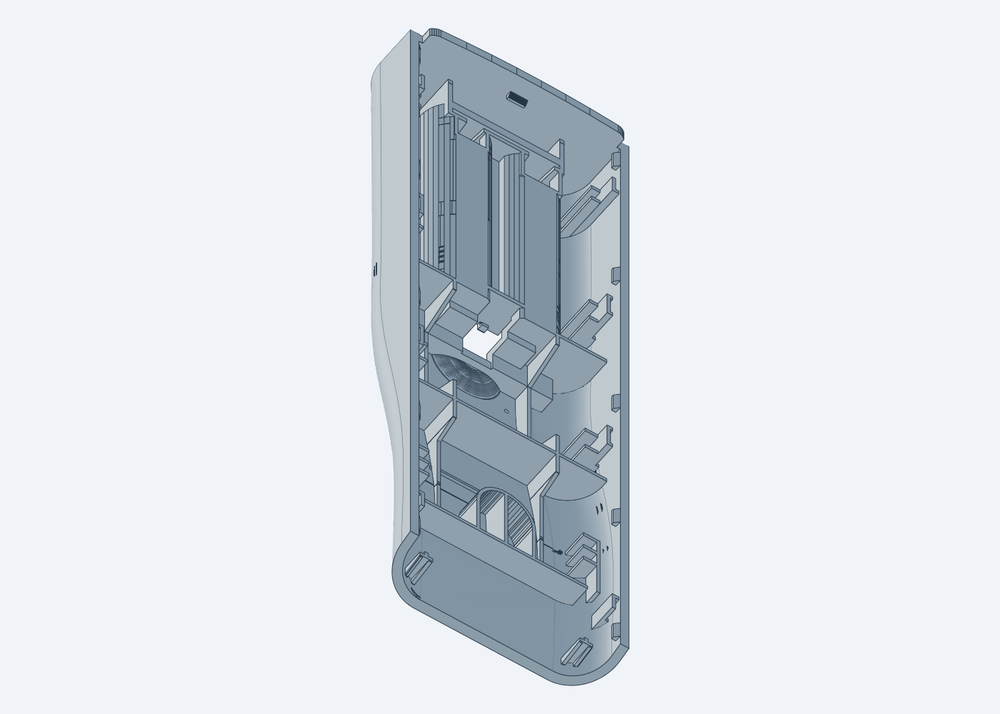
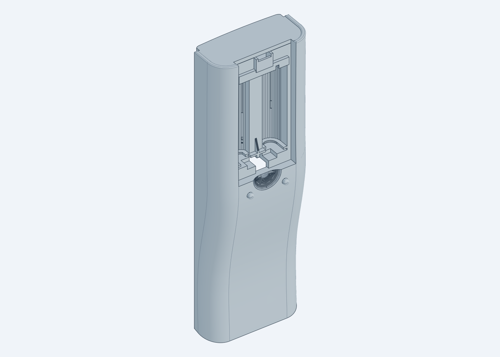
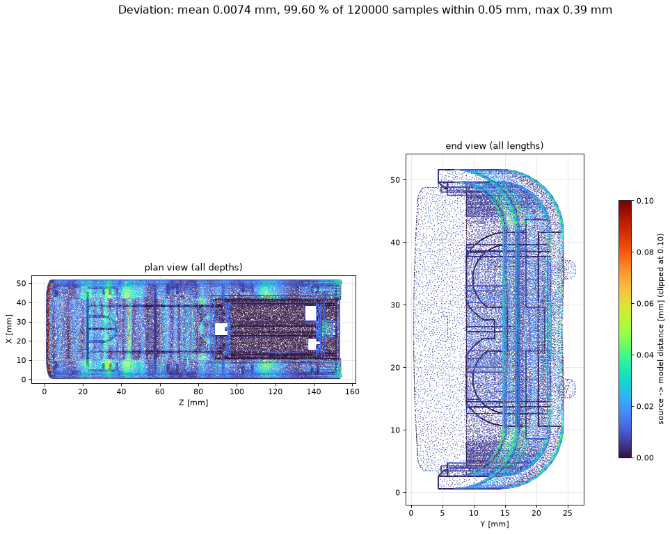
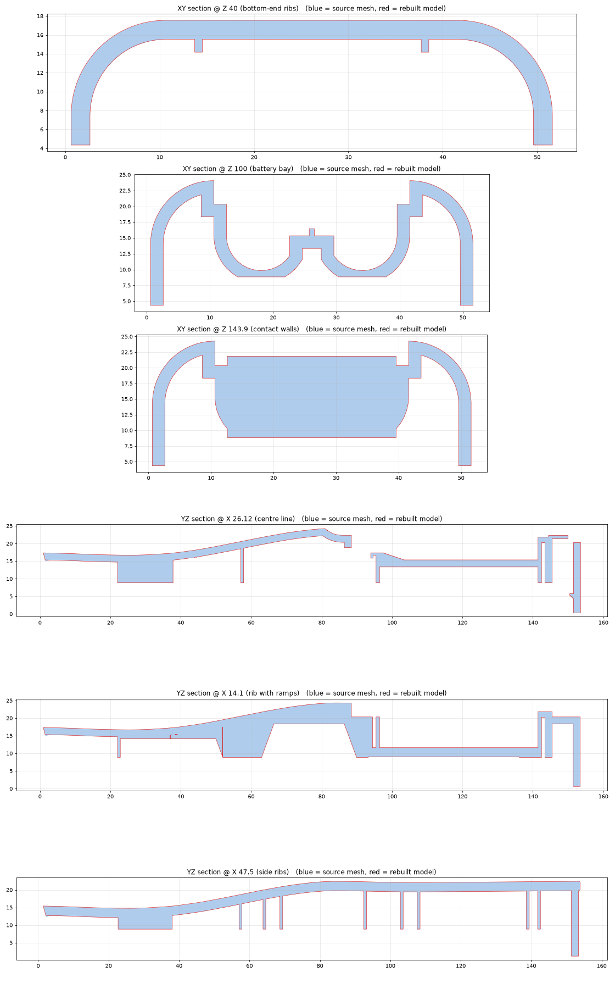

# Rear Case ("base"): Reverse Engineering

Mesh-to-CAD reverse engineering of the TE-12XCME rear case (`source/base.STL`). This is the part the battery cover in `../battery_cover_RE/` fits into.

- **Result:** a single valid STEP solid (`STEP/base.step`) and a watertight STL. **99.6 % of the surface is within ±0.05 mm** of the source (mean 0.007 mm, Hausdorff 0.40 mm). Volume is +0.05 %.
- **How it is built:**
  - a parametric envelope: S-profile skin, R10 blends, 2.0 wall, slanted bottom end, top rim/slot/opening, revolved finger recess, bosses;
  - 53 ribs extruded "up to the skin";
  - section-driven detail prisms for the rest.
- **Findings:**
  - The battery cover's 0.34 mm curvature matches this case's skin, so it is design intent. The cover report has been corrected.
  - The cover sits in the case with only contact-level overlap.
  - 0° draft on the ribs.
- **Exceptions (listed honestly):** a thin inner lip at the bottom end, about 10 mm³, is not modelled, and a few short tab and rib-end faces are off by up to 0.4 mm.

Full write-up: **[REPORT.md](REPORT.md)**

## DFM review for injection moulding (ABS, assumed)
- 24-slide toolmaker DFM report: `output/DFM.pptx`
- DFM-corrected part: `output/part_DFM.step`
- Pipeline and code: [dfm/](dfm/README.md)

| Rebuilt (inside) | Rebuilt (outside) |
|---|---|
|  |  |

| Deviation | Source vs rebuilt sections |
|---|---|
|  |  |
