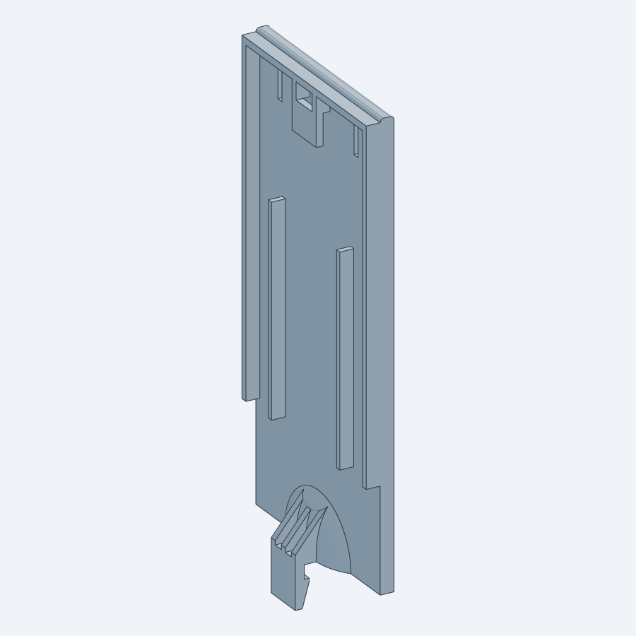

# Battery Cover: Reverse Engineering

Mesh-to-parametric-CAD reverse engineering of a snap-latch battery door, starting from `../battery cover.FCStd`.

- **Result:** a feature-based STEP model that reproduces the source to **0.055 mm** (99.99 % of the surface within ±0.05 mm), plus a flat design-intent version.
- **Findings:** a 0.34 mm plate bow, an unfused hook leg in the source CAD, and 0° draft throughout.
- **DFM:** one mould undercut (retention hook) and draft and radius recommendations.

Full write-up: **[REPORT.md](REPORT.md)**

| Design-intent model | Deviation map |
|---|---|
|  |  |
