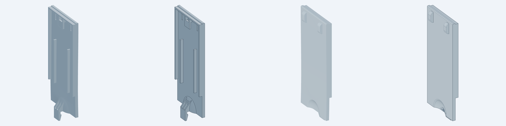
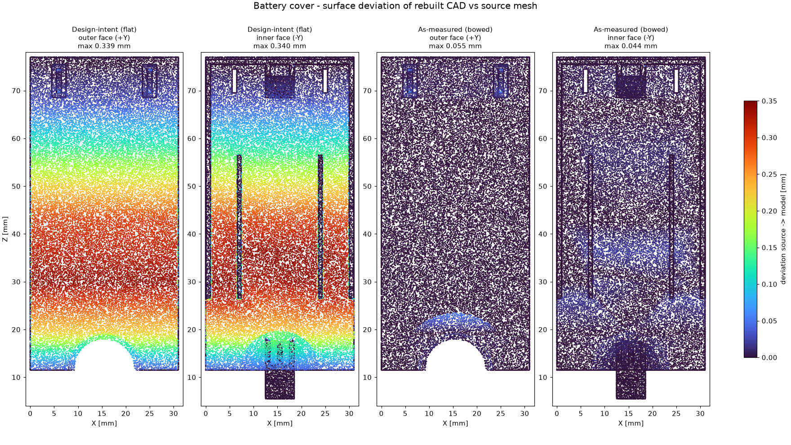

# Battery Cover: Reverse Engineering Report

**Input:** `battery cover.FCStd` (FreeCAD 1.1). It contains one `Mesh::Feature`, a triangulated body with no feature tree.
**Output:** a parametric, feature-based B-rep model (STEP), watertight STLs, a deviation report and a moldability/DFM review.


*Left of each pair: source mesh. Right: rebuilt STEP. Inner (−Y) and outer (+Y) faces.*

---

## 1. Result summary

| Item | Result |
|---|---|
| Part type | Snap-latch battery door. It has a thumb-release recess, a bottom snap latch, and a top tongue/hook retention. |
| Envelope | 31.0 × 9.0 × 71.5 mm (X × Y × Z) |
| Nominal wall | 2.0 mm (plate and thumb recess) |
| Volume / mass | 4.607 cm³ → 4.8 g ABS, 5.3 g PC/ABS, 5.5 g PC |
| Rebuilt model | 1 valid solid, 97 B-rep faces (design intent) / 123 (as measured) |
| **Accuracy, as-measured model** | **Hausdorff 0.055 mm; 99.99 % of surface within ±0.05 mm; volume −0.05 %** |
| Accuracy, design-intent model | Max 0.34 mm. The whole difference is the measured plate bow (see §4.1). |
| Topology | Genus 1 (one through-opening, at the retention hook), same as the source |

---

## 2. Method

1. **Extraction.** Decoded FreeCAD's binary `MeshKernel.bms`: 2,655 vertices and 5,310 facets. The mesh is closed, consistently wound, one body, Euler number 0. Exported as `source/battery_cover_original.stl`.
2. **Feature recognition:**
   - Clustered facets by normal and plane offset to get every planar datum.
   - Took cross-sections in YZ, XZ and XY at 30+ stations.
   - Read the section polygons back as exact vertex coordinates.
3. **Surface fitting:**
   - Found the plate bow by ray-casting the outer and inner faces on a grid. Both faces follow the same X-independent polyline, keeping a constant 2.00 mm wall.
   - Removed the bow, then fitted the thumb recess. It is a surface of revolution about an axis along Y through (X 15.5, Z 11.5). Least-squares circle fits gave a max residual of 0.014 mm.
4. **Parametric rebuild.** Built in build123d/OpenCascade through the `cadgen` model contract. Every dimension is a named parameter in `src/lib/geometry.py`.
5. **Verification:**
   - Two-way surface deviation: 60k samples each way.
   - B-rep validity, volume and topology.
   - Visual comparison from matched cameras.

### Coordinate frame (kept identical to the source for 1:1 comparison)

| Axis | Meaning |
|---|---|
| X | Width, 0 → 31 |
| Y | Thickness. **+Y = exterior (cosmetic) face** at Y = 20; inner features point to −Y |
| Z | Length. Latch end Z = 5.5 (plate starts at 11.5), tongue end Z = 77 |

---

## 3. Feature map and recovered dimensions (mm)

| # | Feature | Recovered geometry |
|---|---|---|
| 1 | **Plate** | X 0–31, Z 11.5–77, wall 2.0 (Y 18–20). R0.5 on both top edges (Z 77). |
| 2 | **Thumb recess**, revolved about Y at (X 15.5, Z 11.5) | Flat floor Ø5.1 at Y 18.0 (depth = full wall). Concave R7.1 arc to R1.25 convex rim blend. Rim Ø ≈ 16. Constant 2.0 wall (inner arc R9.1, concentric). |
| 3 | **Snap latch** | Width 6.0 (X 12.5–18.5). Arm Y 13.0–14.3 (1.3 thick), hanging to Z 5.5. Catch tooth protrudes 0.7 (to Y 15.0) with its catch face at Z 9.5. Lead-in ramp from the 1.0 tip at Z 5.5 to the tooth at Z 9.0. Connects to the recess shell through a 1.0 floor (Z 11.5–12.5) and a 39.8° ramp (dz/dy = 1.2). |
| 4 | **Latch coring** | Two 1.5 wide slots (X 13.5–15.0, 16.0–17.5) through the ramp down to the floor, leaving three 1.0 ribs. |
| 5 | **Side rails** | 1.0 wide at X 0–1 and 30–31. Z 26.5–75.5, free edge at Y 16.0. |
| 6 | **Stiffening ribs** | 2 × 0.8 wide (40 % of wall), centred at X 7.0 and 24.0. Z 26.5–56.5, free edge at Y 16.0. |
| 7 | **Top tongue (lip)** | Full width, Z 75.5–76.5 (1.0), projecting to Y 16.0 |
| 8 | **Retention hook** | Block 6.0 × 4.5 × 1.0 (X 12.5–18.5, Z 68.5–73.0, Y 16–17) with a **1.0 gap** to the plate. Two 1.0 legs (Z 73–75.5) tie it to the lip, leaving a 4.0 × 2.5 window. |
| 9 | **Outer bumps** (×2) | 3.0 × 7.0 footprint, 2.0 proud. Centred at X 6.0 and 25.0, Z 68.5–75.5. R2.0 ends, R0.25 side edges. |
| 10 | **Bump coring** (×2) | 1.0 wide pocket from the inner side, Z 69.5–74.5, to Y 21.0 (R0.5). Leaves 1.0 bump walls and prevents a 4 mm thick section. |

---

## 4. Findings in the source data

### 4.1 Plate bow: 0.34 mm, not design intent
The plate is not flat. Both faces shift together in −Y, with the wall held at a constant 2.00 mm. The shift follows a piecewise-linear profile:

| Z | 11.5 | 19.3 | 29.84 | 42.70 | 67.25 | 76.5 |
|---|---|---|---|---|---|---|
| Outer-face Y | 19.968 | 19.782 | **19.661** | 19.704 | 19.966 | 20.000 |

The rails, ribs, lip and hook are **not** bowed: their free edges sit exactly on Y = 16.000. The break points also fall at non-round mesh-vertex coordinates. Together, that points to a deformed or scan-fitted plate skin rather than a modelled curvature.

Two models are delivered:
- **`battery_cover`: design intent**, flat plate. Use this one for tooling and drawings.
- **`battery_cover_as_measured`**: reproduces the bow for 1:1 fit checks. If the bow is intentional warpage pre-compensation, this is the tooling model instead.

### 4.2 Unfused right hook leg (source CAD defect)
The source mesh contains an **internal coincident face** (1.0 × 2.5 mm, at Y 18, X 17.5–18.5, Z 73–75.5). The right hook leg touches the plate but was never Boolean-fused to it. Slicers and mold-flow meshers can read this as a crack at the root of a load-bearing feature. The rebuilt model fuses it. Deviation statistics exclude those internal samples (32 of 60,000).

### 4.3 Zero draft everywhere
Every wall parallel to the pull direction has 0° draft: **1,372 mm²** in total (see §6).

---

## 5. Accuracy



| Metric (source ↔ model) | Design intent | As measured |
|---|---|---|
| Mean deviation | 0.129 mm | **0.002 mm** |
| P95 / P99 | 0.330 / 0.338 mm | **0.011 / 0.019 mm** |
| Max (Hausdorff, two-way) | 0.340 mm | **0.055 mm** |
| Surface within ±0.05 mm | 42.8 % | **99.99 %** |
| Volume Δ | +0.73 % | **−0.05 %** |

The remaining error on the as-measured model is under 0.055 mm and sits on the curved faces: the R2 bump ends and the recess rim. That is the chord error of the source's coarse triangulation (flat facets across true arcs), not a modelling gap.

---

## 6. DFM review: injection moulding

**Pull direction:** ±Y (plate normal). The cavity forms the cosmetic +Y face; the core forms the −Y features.

### 6.1 Wall thickness
| Feature | Section | Ratio to 2.0 wall | Note |
|---|---|---|---|
| Plate / recess shell | 2.0 | 1.00 | uniform, good |
| Ribs | 0.8 | 0.40 | ✔ within the 0.4–0.6 sink-free guideline |
| Rails, lip, hook block, hook legs | 1.0 | 0.50 | ✔ |
| Latch arm | 1.3 | 0.65 | ✔ |
| Latch floor and ribs | 1.0 | 0.50 | ✔. Coring already removes the 5 mm solid |
| Bump walls | 1.0 | 0.50 | ✔. Coring already removes the 4 mm solid |

Wall design is already well controlled: no thick nodes, all ribs ≤ 0.6 t. The flow length/wall ratio is ≈ 36:1, easily fillable in ABS, PC/ABS or PC.

### 6.2 Undercut: retention hook gap (the only one)
The analysis flagged **29 mm²** of shadowed surface: the 1.0 mm gap between the hook block and the plate (Z 68.5–73). A straight-pull tool cannot form it. Options:
1. **Angled lifter** on the core side, releasing toward −Z. It keeps the cosmetic face intact but adds tool cost.
2. **Pass-through (shut-off) core.** Open a ≈ 4 × 4.5 mm window in the plate under the block so cavity steel forms the gap. There is no side action, but the hole shows on the outer face, which is acceptable only if the housing lip covers Z ≥ 68.5.
3. **Redesign the hook** as an open L-hook, removing the gap's back face. This is the lowest tool cost; the housing interface needs checking.

### 6.3 Draft (currently 0°)
| Zone | Zero-draft area | Recommended draft |
|---|---|---|
| Side rails | 400 mm² | 0.5°/side (sliding guide: keep the fit face minimal) |
| Plate perimeter | 322 mm² | 1°. Cosmetic texture: +1° per 0.025 mm texture depth |
| Ribs | 246 mm² | 0.5°/side (tip stays ≥ 0.75 mm) |
| Snap latch | 114 mm² | 0.5°; keep the catch face (Z 9.5) sharp |
| Top lip | 108 mm² | 0.5° |
| Outer bumps / coring | 110 mm² | 1° |
| Retention hook | 49 mm² | 0.5° |

### 6.4 Stress and function
- **Sharp internal corners.** Rib roots, the latch-arm root and the hook-leg roots are sharp. Add R0.3–0.5 (0.25–0.5 t) to cut stress concentration, especially at the latch root, which sees repeated release cycles.
- **Latch mechanics.** The arm is only ≈ 2 mm long from the floor to the catch, with length/thickness ≈ 1.7. The arm itself is effectively rigid. The 0.7 mm catch release must come from bending of the plate end through the thumb recess.
  - **Recommend a nonlinear FEA** with contact against the housing. It should check peak strain against the resin's allowable strain for repeated snap-fit use, and the thumb release force.
  - Material allowables and force targets must be set against the chosen resin's datasheet and the product requirement.
- **Gate.** Keep gates off the +Y cosmetic face. A tunnel/sub-gate into the −Y side between the ribs gives balanced flow to both ends. Confirm with a fill simulation.

---

## 7. Deliverables

| Path | Content |
|---|---|
| `freecad/BatteryCover_Parametric.FCStd` | **Native FreeCAD PartDesign tree**: 10 fully constrained sketches, 12 features, driven by a `Params` spreadsheet (see `freecad/README.md`) |
| `freecad/BatteryCover_PartDesign.FCMacro` | Macro that rebuilds the full tree from scratch |
| `STEP/battery_cover.step` | **Design-intent solid**. Open in FreeCAD with *File → Import*, or in SolidWorks, Creo or NX |
| `STEP/battery_cover_as_measured.step` | Bowed variant, 0.055 mm to the source |
| `STL/*.stl` | Watertight meshes (0.005 mm chord) |
| `src/lib/geometry.py` | Parametric model. All dimensions are named constants |
| `src/battery_cover*.py` | Model entry points (`python src/battery_cover.py`) |
| `src/export_stl.py` | Watertight STL writer |
| `checks/deviation.py`, `deviation_report.json` | Accuracy verification |
| `checks/dfm.py`, `dfm_report.json` | Draft, undercut, thickness and mass analysis |
| `source/battery_cover_original.stl` | Mesh extracted from the FCStd |

### Rebuild
```bash
pip install "cadgen[snapshot]==0.6.5" trimesh scipy rtree matplotlib
cd battery_cover_RE
python src/battery_cover.py && python src/battery_cover_as_measured.py
python src/export_stl.py
python checks/deviation.py && python checks/dfm.py && python checks/plots.py
```

---

## 8. Assumptions and limits
- **Units** are mm, from the FreeCAD document's Standard unit system. **Material** is unknown; masses are given for common battery-door resins.
- **Function** (tongue at the top, thumb-release snap at the bottom, which side is cosmetic) is inferred from the geometry. The mating housing was not supplied.
- The **recess radii** (R7.1 / R9.1 / R1.25) and the flat-floor radius (2.55) are fitted values. They could be rounded to R7 / R9 if the original drawing confirms it; that changes the surface by < 0.1 mm.
- DFM draft and radius values are standard guideline recommendations. They are not yet applied to the model, so the delivered geometry stays faithful to the source.
